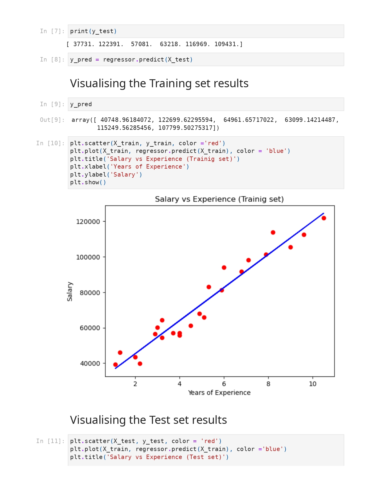
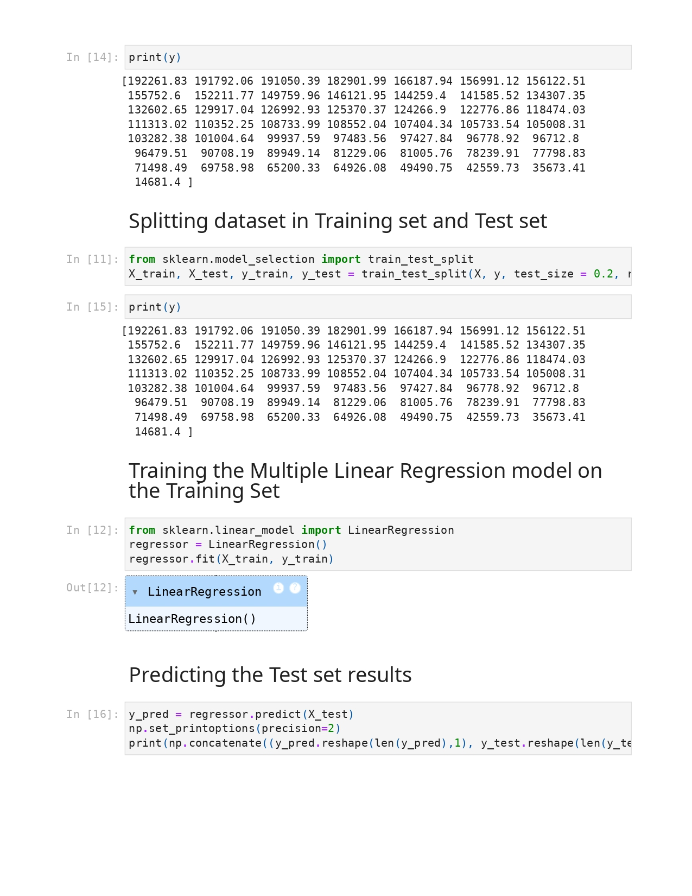
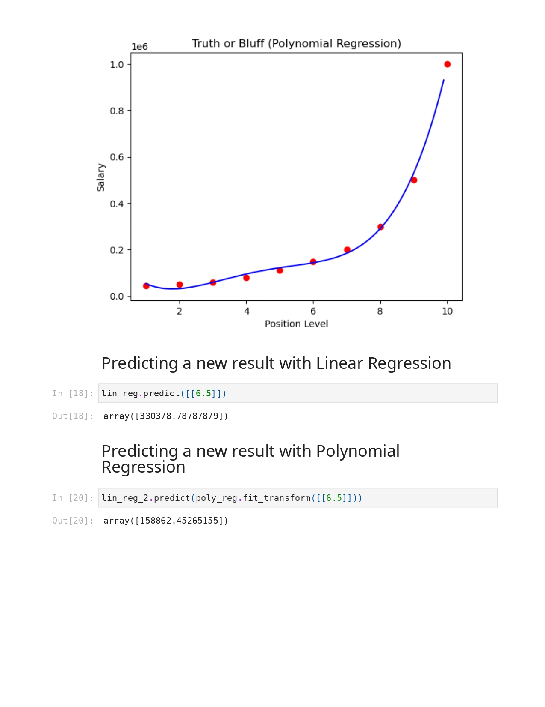
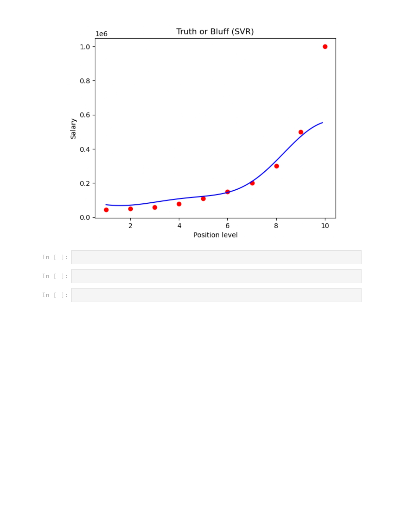
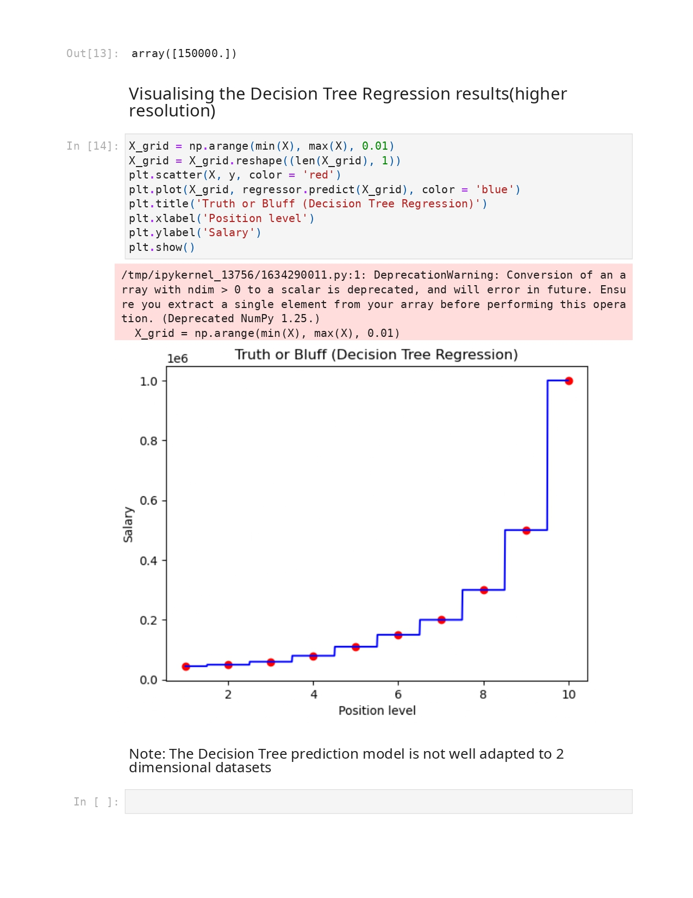
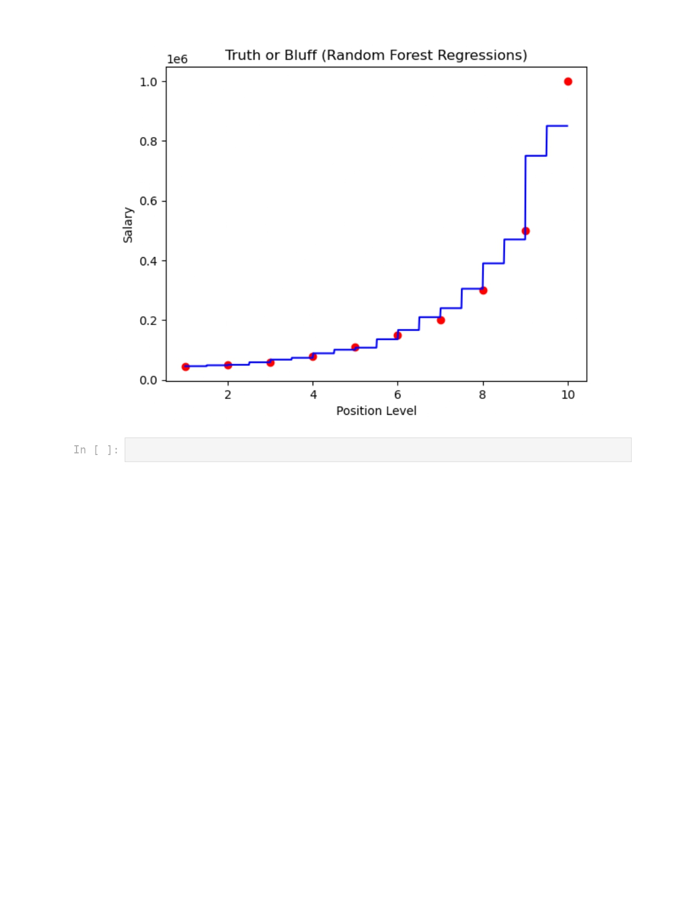

# Machine Learning: Regression Analysis Series

Welcome to my Machine Learning Regression repository. This project demonstrates a systematic approach to predictive modeling, covering fundamental linear techniques to advanced ensemble-based non-linear algorithms.

---

## 📋 Project Overview
This collection of notebooks provides a hands-on implementation of various regression algorithms using **Python** and **Scikit-Learn**. Each module explores the predictive performance, model behavior, and visual representation of its respective technique.

| Module | Regression Model | Primary Focus |
| :--- | :--- | :--- |
| **02** | Simple Linear | Baseline performance & linear trends |
| **03** | Multiple Linear | Feature interaction & multi-variate modeling |
| **04** | Polynomial | Capturing non-linear curvature |
| **05** | Support Vector | Finding optimal margins in higher dimensions |
| **06** | Decision Tree | Hierarchical data partitioning |
| **07** | Random Forest | Ensemble learning for high-accuracy predictions |

---

## 🛠 Technology Stack
- **Languages:** Python
- **Core Libraries:** `Scikit-Learn`, `Pandas`, `NumPy`, `Matplotlib`
- **Development Environment:** Jupyter Notebook

---

## 📊 Visual Model Comparison

Below are the key results representing the behavior of each model.

### 1. Simple Linear Regression
*Visualizing the linear relationship between the dependent variable and a single feature.*


### 2. Multiple Linear Regression
*Extending the model to incorporate multiple features for complex predictions.*


### 3. Polynomial Regression
*Transforming features to model non-linear data patterns.*


### 4. Support Vector Regression (SVR)
*Utilizing kernel functions to fit data within specified error margins.*


### 5. Decision Tree Regression
*Predicting outcomes by partitioning data into hierarchical decision regions.*


### 6. Random Forest Regression
*Improving robustness by averaging multiple decision trees.*


---

## 💡 Model Performance Summary

| Model | Complexity | Best For |
| :--- | :--- | :--- |
| **Linear** | Low | Simplicity & Interpretability |
| **Polynomial** | Medium | Data with clear non-linear curvature |
| **SVR** | Medium/High | Complex boundaries & smaller datasets |
| **Decision Tree** | High | Intuitive non-linear logic |
| **Random Forest** | Very High | Maximum accuracy & complex relationships |

---

## Getting Started
To reproduce these results, ensure your environment is configured:

1. **Clone the repository:**
   ```bash
   git clone [https://github.com/5joe/Machine_Learning_A-Z]